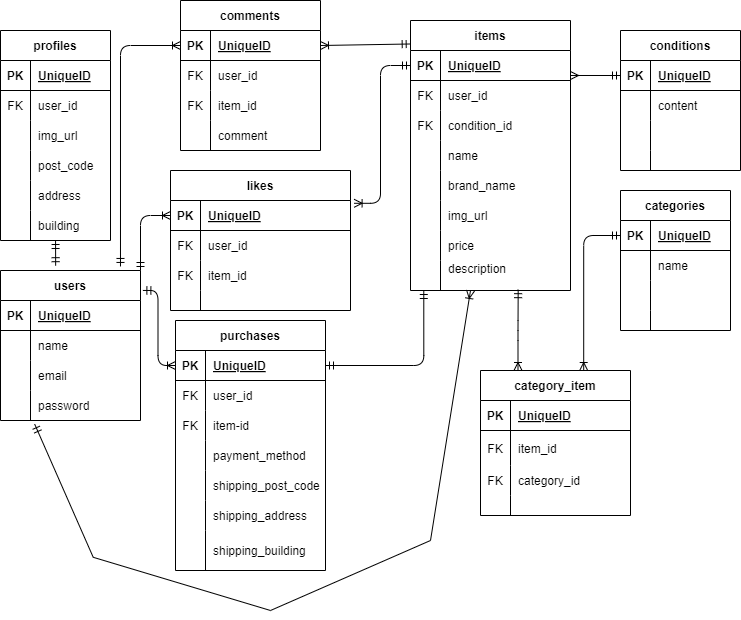

# flea-market-app1  

## 環境構築  
### Dockerビルド  
1. git clone git@github.com:coachtech-material/laravel-docker-template.git  

 mv laravel-docker-template flea-market-app1  
   

2. DockerDesktopアプリの立ち上げ  
3. docker-compose up -d --build  
### Laravel環境構築  
1. docker-compose exec php bash  
2. composer install  
3. .envに環境変数を追加  
    DB_HOST = mysql  
    DB_DATABASE=laravel_db  
    DB_USERNAME=laravel_user  
    DB_PASSWORD=laravel_pass  
4. アプリケーションキーの作成  
    php artisan key:generate  
5. マイグレーションの実行  
    php artisan migrate  
6. シーディングの実行  
    php artisan db:seed  
7.  シンボリックリンク  
    php artisan storage:link  

## ユーザーのダミーデータ（管理者）  

    1. メールアドレス:nobu@gmail.com  
    　　パスワード：nobunobunobu  
    2. メールアドレス：hurudanuki@gmail.com  
        パスワード：ponponpon  
## 一般ユーザーのダミーデータ  
        メールアドレス:seneka@roma.com  
        パスワード:senekaseneka  
        

##  メール認証  
1. .envファイルに追加  
    MAIL_MAILER=smtp  
    MAIL_HOST=mailhog  
    MAIL_PORT=1025  
    MAIL_USERNAME=null  
    MAIL_PASSWORD=null  
    MAIL_ENCRYPTION=null  
    MAIL_FROM_ADDRESS=test@example.com  
    MAIL_FROM_NAME="Flea Market App1"  
2. コンテナ再起動  
    docker-compose down  
    docker-compose up -d  
##  stripe決済の設定  
    composer require stripe/stripe-php  
    config/services.phpに追加  
    return [  
        'stripe' => [  
            'key' => env('STRIPE_KEY'),  
            'secret' => env('STRIPE_SECRET'),  
        ],  
    ];  
    .envに STRIPE＿KEYとSTRIPE＿SECRETを貼り付ける  
## テスト  
1. docker-compose exec mysql bash  
2. テスト用データーベースの用意  
    mysql -u root -p  
    > CREATE DATABASE demo_test;  
      
3. テスト用.envファイル作成と編集  

    $ cp .env .env.testing  
        APP_NAME=Laravel  
        APP_ENV=test  
        APP_KEY=  
        APP_DEBUG=true  
        APP_URL=http://localhost  

        DB_CONNECTION=mysql  
        DB_HOST=mysql  
        DB_PORT=3306  
        DB_DATABASE=demo_test  
        DB_USERNAME=root  
        DB_PASSWORD=root  
    こちらにもSTRIPE＿SECRETを貼り付ける  
4. テスト用アプリケーションキーの作成  
    php artisan key:generate --env=testing  
    php artisan config:clear  
5. マイグレーション  
    php artisan migrate --env=testing  
## クローン  
1. cd coachtech/laravel    
2. git clone git@github.com:yuriko52-star/flea-market-app1.git  
3. mv flea-market-app1 app-check1  
4. app-check1のリポジトリ作成    
5. cd app-check1  
6. git remote set-url origin git@github.com:yuriko52-star/app-check1.git  
7. git remote -v  
8. git add .  
9. git commit -m "コメント"  
10. git push origin main  
11. メール認証　docker-compose.ymlのcontainer_nameを修整    
12. docker-compose up -d --build  
13. docker-compose exec php bash  
14. composer install  
15. cp .env.example .env  
16. .envに環境変数を追加(上記参照)  
    MAIL_FROM_ADDRESS=test@example.com  
    MAIL_FROM_NAME="Flea Market App1" 
17. php artisan key:generate  
18. php artisan migrate  
19. php artisan db:seed  
20. php artisan storage:link  
21. docker-compose exec mysql bash  
22. mysql -u root -p  
23. CREATE DATABASE demo_test;  
24. php artisan migrate --env=testing  

## pro入会テスト用  
1.  php artisan make:migration add_status_to_purchases_table --table=purchases  
 既存のpurchasesテーブルにstatusカラムを追加  
2. mypabe.blade.phpに 取引中商品のタブを追加  
3. php artisan make:migration create_messages_tableでチャット用のテーブルを作成  
4. chat.blafr.phpを作成  

## URL
- 開発環境：http://localhost/  

- phpMyAdmin:http://localhost:8080/  

- メール認証(MailHog): http://localhost:8025/  

## ER図  
  
  

## 使用技術（実行環境）  
 - PHP7.4.9  
 - Laravel8.83.29  
 - MySQL8.0.26  