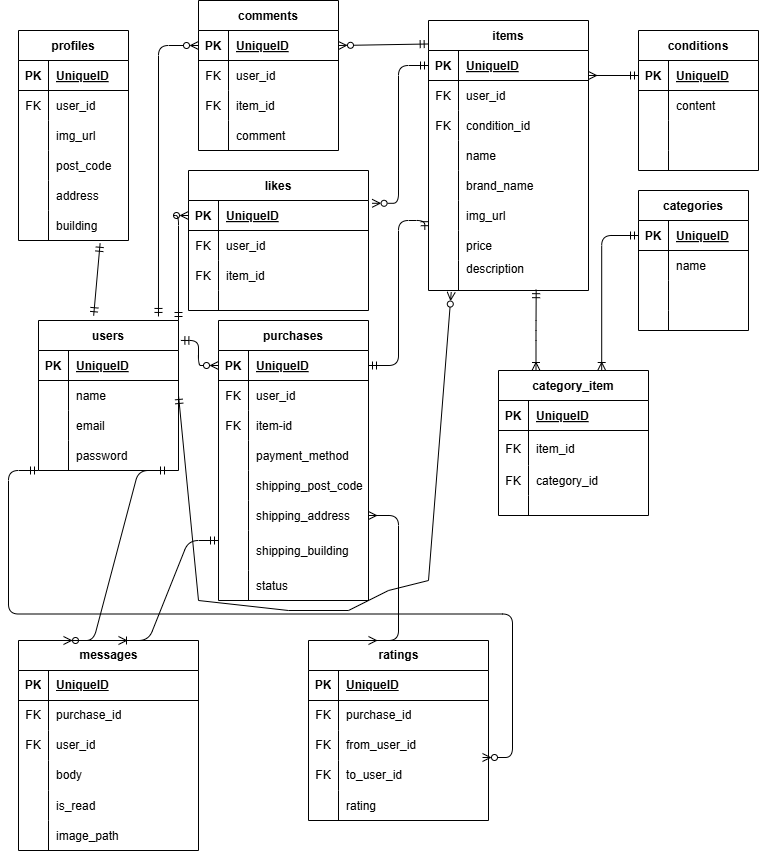

# flea-market-app1  

## 環境構築  
### Dockerビルド  
1. git clone git@github.com:coachtech-material/laravel-docker-template.git  

 mv laravel-docker-template flea-market-app1  
   

2. DockerDesktopアプリの立ち上げ  
3. docker-compose up -d --build  
### Laravel環境構築  
1. docker-compose exec php bash  
2. composer install  
3. .envに環境変数を追加  
    DB_HOST = mysql  
    DB_DATABASE=laravel_db  
    DB_USERNAME=laravel_user  
    DB_PASSWORD=laravel_pass  
4. アプリケーションキーの作成  
    php artisan key:generate  
5. マイグレーションの実行  
    php artisan migrate  
6. シーディングの実行  
    php artisan db:seed  
## ユーザーのダミーデータ  
    1. メールアドレス:nobu@gmail.com  
    　　パスワード：nobunobunobu  
    2. メールアドレス：hurudanuki@gmail.com  
        パスワード：ponponpon  

##  メール認証  
1. docker-compose.ymlに追加  
    app:  
    build: ./docker/php  
    container_name: laravel_app  
    ports:  
        - "8000:8000"  
    volumes:  
        - .:/var/www  
    depends_on:  
        - mailhog  
    mailhog:  
    image: mailhog/mailhog  
    ports:  
        - "1025:1025"   # SMTPサーバー  
        - "8025:8025"   # Web UI  
2. コンテナ起動  
    docker-compose up -d  
3. .envファイルに追加  
    MAIL_MAILER=smtp  
    MAIL_HOST=mailhog  
    MAIL_PORT=1025  
    MAIL_USERNAME=null  
    MAIL_PASSWORD=null  
    MAIL_ENCRYPTION=null  
    MAIL_FROM_ADDRESS=test@example.com  
    MAIL_FROM_NAME="Flea Market App1"  
4. コンテナ再起動  
    docker-compose down  
    docker-compose up -d  
##  stripe決済の設定  
    composer require stripe/stripe-php  
    config/services.phpに追加  
    return [  
        'stripe' => [  
            'key' => env('STRIPE_KEY'),  
            'secret' => env('STRIPE_SECRET'),  
        ],  
    ];  
    

## URL
- 開発環境：http://localhost/  

- phpMyAdmin:http://localhost:8080/  

- メール認証(MailHog): http://localhost:8025/  

## ER図  
  
  

## 使用技術（実行環境）  
 - PHP7.4.9  
 - Laravel8.83.29  
 - MySQL8.0.26  